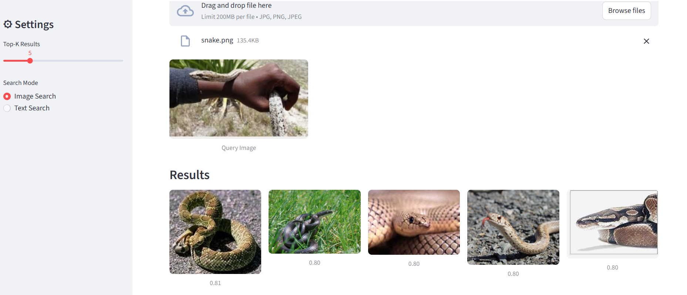
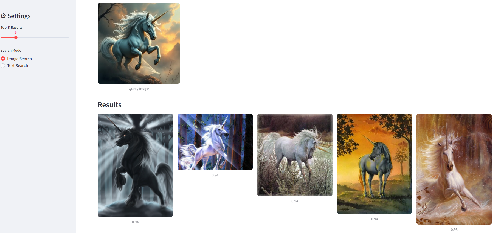
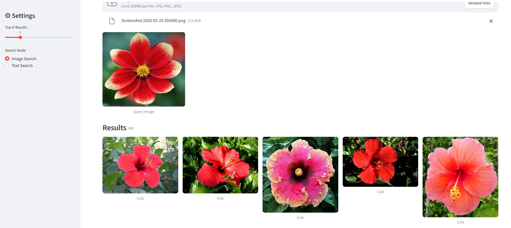
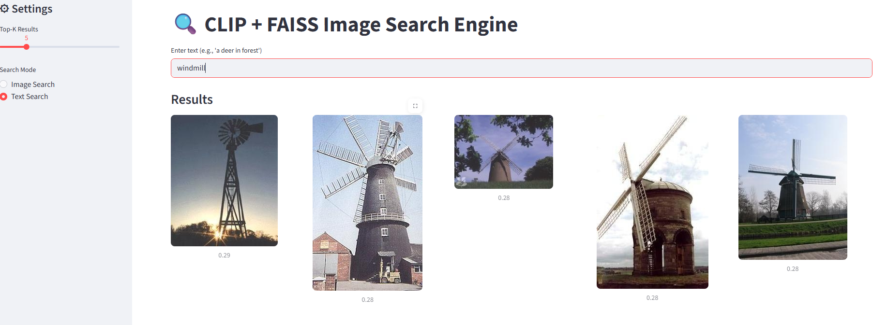
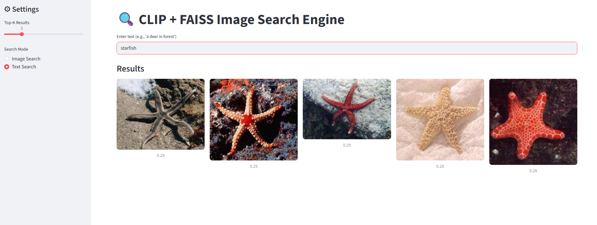
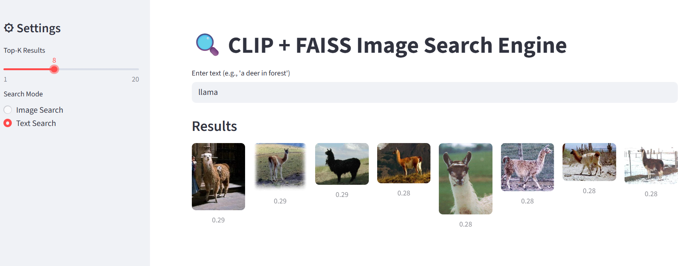
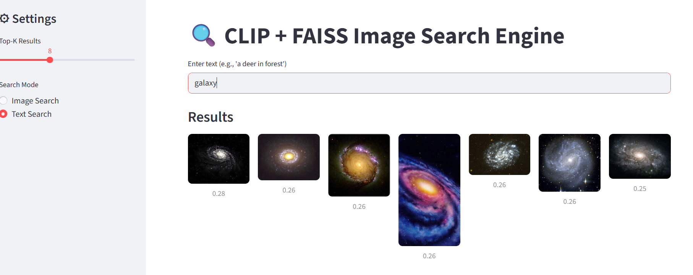

#  Multimodal Image & Text Search using CLIP & FAISS

This project implements an image and text-based search engine using OpenAI's CLIP model and FAISS for efficient similarity search.  
Users can search images either by uploading an image or by entering a text description.

---

##  Features
- Image-to-image similarity search
- Text-to-image search
- CLIP (ViT-L/14) for joint image-text embeddings
- FAISS for fast cosine similarity search
- Streamlit web interface
- Works on Caltech-256 dataset (30,000+ images)

---

##  Model Used
- CLIP ViT-L/14
- Image and text embeddings normalized for cosine similarity

---

## 📸 Project Screenshots

### 🔎 Image Search

- 
- 
- 
- 
- 

---

### 📝 Text Search

- 
- 
- 
- 
- 

---

##  Dataset
- **Caltech-256**

Download from Kaggle:

```bash
kaggle datasets download -d jessicali9530/caltech256
unzip caltech256.zip
```
##  Installation

```bash
pip install -r requirements.txt
```

##  Generate Image Embeddings & FAISS Index

```bash
python extract_features.py
```

##  Run the Streamlit App

```bash
streamlit run app.py
```


